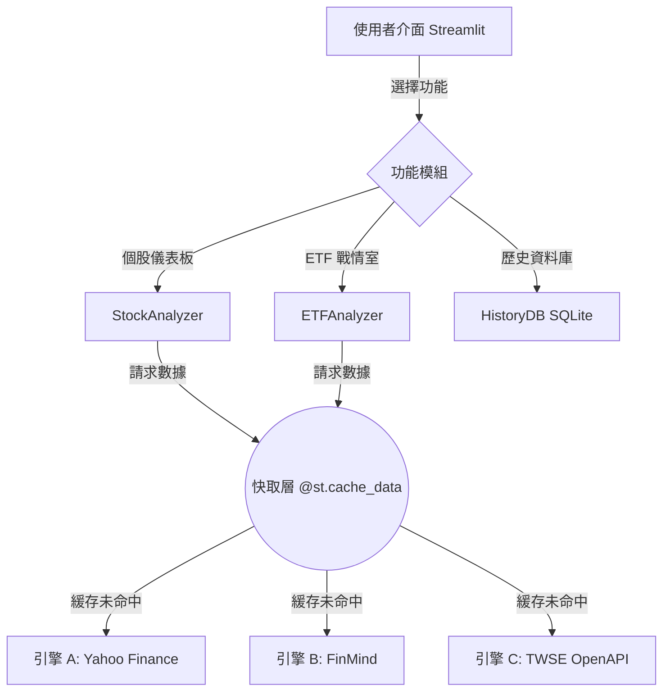

# 📊 台股 AI 深度搜索 — 數據處理白皮書

> **版本**: 1.0  
> **最後更新**: 2026-02-22  
> **適用對象**: 開發者、進階使用者、審計人員

---

## 目錄

1. [系統架構總覽](#1-系統架構總覽)
2. [三引擎數據源架構](#2-三引擎數據源架構)
3. [數據擷取與快取機制](#3-數據擷取與快取機制)
4. [技術指標計算引擎](#4-技術指標計算引擎)
5. [基本面分析模組](#5-基本面分析模組)
6. [AI 決策引擎](#6-ai-決策引擎)
7. [獨立雙軌制投資框架分析](#7-獨立雙軌制投資框架分析)
8. [策略回測系統](#8-策略回測系統)
9. [ETF 評估模型](#9-etf-評估模型)
10. [資料庫與持久化](#10-資料庫與持久化)
11. [資料完整性與容錯](#11-資料完整性與容錯)
12. [已知限制與風險揭露](#12-已知限制與風險揭露)

---

## 1. 系統架構總覽

本系統是一套基於 **Streamlit** 的台灣股市分析工具，採用獨創的「三引擎 (Tri-Engine)」數據處理架構，整合三大異質數據源，提供從技術面、基本面到籌碼面的全方位分析。

### 1.1 核心設計哲學

- **多源交叉驗證**：同一指標盡可能從多源取得，以官方數據為主、第三方為輔
- **快取優先**：所有外部 API 呼叫均啟用 TTL 快取，避免重複請求
- **容錯降級**：任一引擎失效不影響其餘功能，系統自動降級至可用數據

### 1.2 系統資料流

---

## 2. 三引擎數據源架構

### 2.1 引擎 A：Yahoo Finance (`yfinance`)

| 項目 | 內容 |
|------|------|
| **負責數據** | 即時股價、歷史 K 線（1 年）、財務資訊、配息紀錄 |
| **TTL** | 300 秒（5 分鐘） |
| **容錯機制** | 優先嘗試 `.TW` (上市)，失敗則 fallback 至 `.TWO` (上櫃) |

### 2.2 引擎 B：FinMind Open Data

| 項目 | 內容 |
|------|------|
| **負責數據** | 三大法人（外資、投信、自營商）買賣超 |
| **TTL** | 3600 秒（1 小時） |
| **預處理** | 擷取近 90 天數據，計算每日淨買賣 (`buy - sell`) 並按日期彙總 |

### 2.3 引擎 C：TWSE OpenAPI（證交所官方）

| 項目 | 內容 |
|------|------|
| **負責數據** | 官方本益比 (PE)、股價淨值比 (PB)、殖利率 (Yield) |
| **TTL** | 1800 秒（30 分鐘） |
| **降級機制** | 若 TWSE API 無資料（如上櫃股），自動降級至 Yahoo Finance 估算值 |

---

## 3. 數據擷取與快取機制

本系統依賴 Streamlit 的 `@st.cache_data` 進行記憶體快取。

- **時效性管理**：股價資料需高頻更新（5 分鐘），官方估值變化較慢（30 分鐘），法人數據每日更新一次（1 小時）。
- **序列化安全**：所有快取函式皆回傳可被 pickle 序列化的標準 Python 物件（DataFrame, dict, list）。
- **時區正規化**：Yahoo Finance 回傳含 UTC 時區的時間戳，進入分析管線前統一使用 `tz_localize(None)` 移除時區，防止 `merge` 錯誤。

---

## 4. 技術指標計算引擎

資料輸入為 1 年期日 K 線，最低需求為 60 根（季線基準）。

### 4.1 移動平均線 (MA) 與布林通道
- **短、中、長均線**：MA5, MA20, MA60。計算收盤價的簡單移動平均 (SMA)。
- **趨勢斜率**：基於 `Series.diff()` 評估 MA20 與 MA60 的一階導數。
- **布林帶**：中軌為 MA20，上下軌為 $\pm 2$ 倍標準差。

### 4.2 相對強弱指標 (RSI)
採用 Wilder 原始演算法（指數平滑法，$\alpha = 1/14$）：
1. 計算每日漲幅 $U$ 與跌幅 $D$。
2. 使用 `ewm(alpha=1/14)` 計算平滑相對強度 $RS = \bar{U} / \bar{D}$。
3. $RSI = 100 - (100 / (1 + RS))$。

### 4.3 MACD 指標
- `DIF` = EMA(12) - EMA(26)
- `Signal` = EMA(DIF, 9)
- `Histogram` = DIF - Signal

---

## 5. 基本面分析模組

### 本益比河流圖 (Implied PE Band)

本系統使用**隱含本益比帶 (Implied PE Band)** 簡化繪製：
1. 取當前股價與當前 PE，推算隱含 EPS：`Implied_EPS = Price / PE`。
2. 以固定倍數 [10x, 15x, 20x, 25x] 乘以 `Implied_EPS` 繪製水平帶。
3. 將歷史股價走勢疊加其上，觀察股價在估值帶中的相對位置。

> ⚠️ 此方法假設 EPS 於觀察期內恆定，適用於獲利穩定的傳產/金融股，景氣循環股則參考價值較低。

---

## 6. AI 決策引擎

決策邏輯採用**自頂向下的否定性排除法**，優先處理極端風險（強過熱、破底）：

1. **🔴 強制賣出 (Sell)**：若 `RSI > 80` (極度超買) 或 `收盤價 < MA60 且 MA60 下彎` (長空確認)，直接判定賣出。
2. **評分機制 (0-3分)**：
   - EPS > 0 (+1)
   - 0 < PE < 20 (+1)
   - 營收年增率 > 0 (+1)
3. **🟢 適合買入 (Buy)**：需同時滿足 `收盤 > MA20 > MA60` (多頭排列) + `MACD 柱狀體 > 0` (動能增強) + `基本面得分 ≥ 2`。
4. **🔵 繼續持有 (Hold)**：符合 `收盤 > MA20 > MA60`，趨勢未破壞。
5. **⚪ 暫時觀望 (Wait)**：不符合上述所有分類者。

---

## 7. 獨立雙軌制投資框架分析

此於介面「🎯 投資分析」分頁中展示，為**獨立於本系統 AI 決策引擎**的另一套分析框架，供使用者作為第二意見參照判斷。框架從兩大維度切入：

### 7.1 財務與估值定錨
- **營收與利潤門檻**：設定嚴謹定額（如營收 > 1億美元）及基礎門檻（EBIT, OCF, FCF 皆大於 0），排除營運高風險或處於草創階段之標的。
- **成長與估值預期**：檢驗「營收增長率」是否落於 15%-20% 的黃金成長區間，並透過市銷率 (PS) / 市淨率 (PB) 觀察市場預期是否過熱。若成長超高 (>40%) 亦被視為具備「失控與預期過高」之風險。

### 7.2 技術面戰術執行（趨勢時鐘）
捨棄傳統死板的多空設定，將 K 線行情以時鐘點位比喻：
- 計算季線 (MA60)、月線 (MA20) 及其斜率，加上現價與月線之「乖離率」。
- **🟢 2點鐘方向 (黃金操作區)**：現價大於月線，且月線大於季線，且月線斜率為正（健康多頭）。唯一允許買進之區域。
- **🔴 極端與災難區域**：
  - **12-1點鐘**：極端樂觀暴漲，乖離率過高，嚴禁追高。
  - **4點鐘**：緩跌格局，嚴禁抄底。
  - **5-6點鐘**：垂直崩潰，伴隨恐慌拋售。

> **⚠️ 注意**：此模組產出之信號僅依據內部硬編碼之條件，與上方第 6 章的「AI 綜合評分決策」是平行運行的兩套邏輯。

---

## 8. 策略回測系統

提供過去 1 年的日線級別策略回測。

### 支持策略
- **MA_Cross (黃金交叉)**：`MA5 > MA20` 時全倉持有，否則空手。
- **RSI_Reversal (RSI反轉)**：`RSI < 30` 買入並持有，直到 `RSI > 70` 賣出空手。

### 績效指標與盲點
- **計算方法**：使用 `Position.shift(1)` 延遲一天進行結算，模擬當日收盤判定、隔日執行。
- **前視偏差**：訊號觸發仍使用當日「收盤價」判定，且以「當日收盤報酬」計算，實務上難以精確複製。
- **摩擦成本**：未計入手續費及證交稅。

---

## 9. ETF 評估模型

基於 Yahoo Finance `funds_data` 擴充的長期存股體檢模型。

1. **規模安全**：檢核 AUM (Net Assets) 是否 > 20 億台幣。低於此門檻有潛在下市清算風險。
2. **成本控管**：嚴格檢視內扣費用 (Expense Ratio)。市值型標的建議 < 0.5%，大於 1% 判定為過高。
3. **溢價警戒**：若 `Premium > 1%`，判定市價偏離淨值過多，發出等待收斂警告。
4. **屬性特化**：針對含「高股息」關鍵字之標的，動態生成稅務 (二代健保) 與週轉率提示。

---

## 10. 資料庫與持久化

- **技術選型**：SQLite3 (`stock_history.db`)
- **表格結構**：`history` 單表存儲，記錄 `(ticker, name, price, verdict, reason, eps, roe, pe)`。
- **執行緒模型**：採短連線模式（每次操作建立新 cursor 並立即 `close()`），規避 Streamlit 多執行緒資源鎖死問題。

---

## 11. 已知限制與發布揭露

1. **分析視角**：本系統所有結論基於日級 (Daily) 數據，不支援當沖或極短線參考。
2. **上櫃資料缺失**：TWSE OpenAPI 目前針對上櫃股票回傳空白，估值預防性降級至 YF 歷史平均。
3. **獲利指標滯後**：Yahoo Finance 之財報資料更新頻率低於證交所公開資訊觀測站，存在時間差。
4. **投資風險警語**：AI 判定結果僅為條件規則之輸出，絕不保證獲利，投資決策請自負盈虧。
